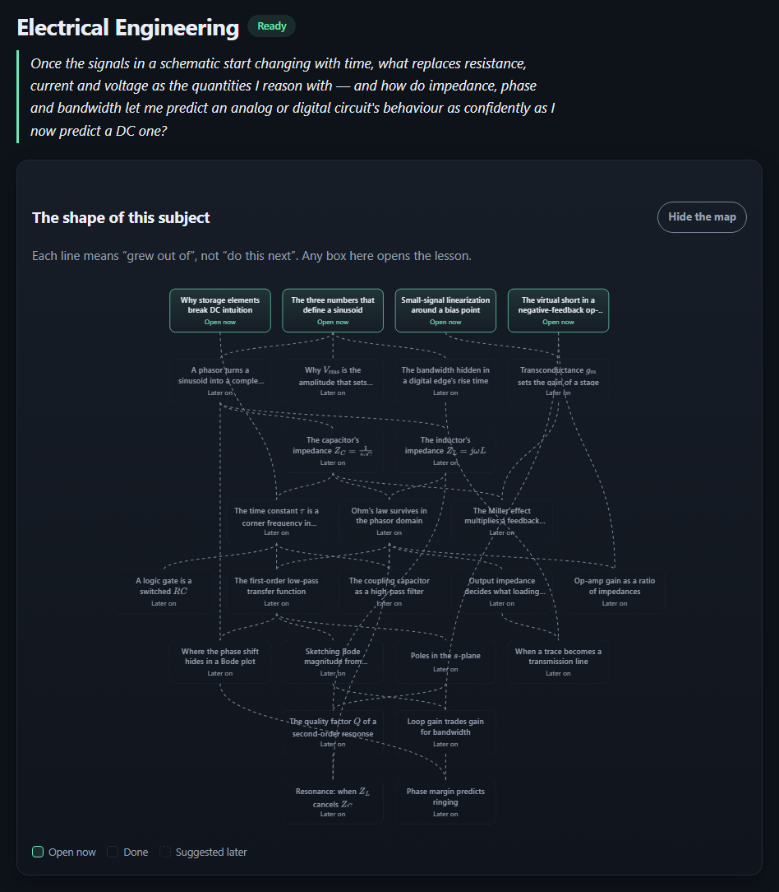
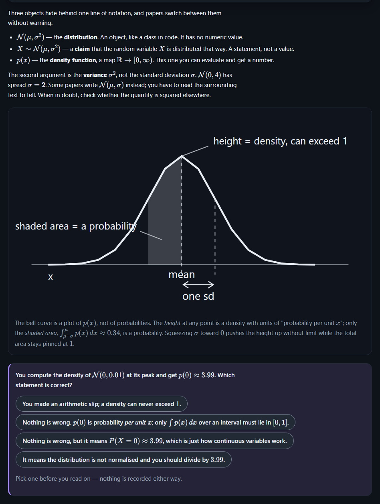

# learn-assistant

A self-directed progressive education tool. I designed this to help me get from "rusty college math" to "understanding frontier AI papers." It succeeded in that, so I figured someone else might be able to use it too.

## How it works

You start by giving the tool an idea of what you already know, and what you want to know. It then generates a curriculum with digestably-short lessons, and a network of prerequisites. At any given time before you reach the final project, there will probably be multiple open lessons to choose from.

The lessons themselves are mixes of text, diagrams, and interactive elements to help you learn the topic.

At the end of each lesson, there is a Socratic evaluation step. Unlike a quiz, the AI asks you questions about the material, and collaboratively helps to sharpen your understanding until you can answer them correctly. If you're really struggling with a concept, it will create a new lesson covering just that subtopic, under the understanding that its first pass may have been too broad to cover it in enough detail. This ensures that if you, like me, have a tendency to overestimate your comprehension of something after you've read it once, any misunderstandings will be corrected before they confuse you later on.

At the end, there is a self-directed final project, which it evaluates and ensures encapsulates the information you've learned.

It runs entirely on your machine except for the LLM (unless you have the compute to run sufficient models in Ollama, in which case it can be completely local). I designed this to use my Claude subscription with the CLI, but it should work fine with any other system that has an API (like OpenRouter, OpenAI, etc).

## Why this exists

I was always intensely frustrated with how math is taught. In my opinion, hand-computation past everyday price math is a complete waste of time, but it dominates curricula in high-school and college because it is easily measurable. What matters is the why. Knowing how to compute the eigenvalue of a 3x3 matrix by hand is utterly useless in practice. Computers are benchmarked on how many trillions of times they can do that per second. The connection with principal component analysis, which is both useful and everywhere, is skipped entirely in favor of being able to replicate numpy.linalg.eig with pencil and paper. The same goes for derivatives and gradient descent, or integrals and ranges in probability distributions. Unlike computation, deep conceptual understanding will actually help you build stuff (and has for me already on unexpectedly many occasions).

I made this tool to address that. After a month or so using it (extremely part time between work, family, and other hobbies), I have a much better working knowledge of math (specifically vector calculus, linear algebra, and statistics) than I had from my computer science education, in which I passed dedicated classes in each of those. I acknowledge that it's difficult to separate the foundations from the new knowledge, but I now understand the how to use the Jacobian (which was not covered in my college courses) better than I previously understood how to use the Eigenvalue (which was).

## Limitations

I have only tested this tool on STEM topics (specifically math and organic chemistry). I suspect that it is more likely to hallucinate on topics that involve more disparate information and fuzziness rather than depth of understanding of something with a complex but concrete right and wrong. In STEM, I cross-check with Wikipedia regularly (good practice when dealing with LLM's, though I've never seen it provide an incorrect fact). Even if it doesn't teach anything overtly incorrect, learning "history according to the narratives most represented in the Pile" will probably introduce major and hard-to-trace distortions, and I wouldn't recommend it. For that, books are still going to be your best source, because they come with authors with identifiable worldviews that can be understood and accounted for.

I use Opus for everything here. It's not enough tokens that it's worth risking quality for cost (at least for me).

## What it looks like


**The shape of a subject.** The researched curriculum is a map, not a list. Each line means one
lesson grew out of another, and any lesson whose groundwork you have covered is open, in whatever
order you like.



**A lesson.** Prose alternates with diagrams and questions that check you actually followed it. The
math is typeset properly.



## Setup and run

### Easiest: Download and run with the start script

Download this repository as a zip, extract it, and then run start.bat.

### Second easiest: Clone and run

```
git clone <this repo>
cd LearnAssistant
./start.sh          # Linux / macOS / Git Bash
start.bat           # Windows (double-clicking it works too)
```

The start script installs dependencies if `node_modules/` is missing, produces a production build if
`.next/BUILD_ID` is missing, and then serves the app. It prints the URL to open:

```
[learn-assistant] Open http://localhost:31544
```

### With Docker

```
git clone <this repo>
cd LearnAssistant
cp .env.example .env      # optional — every value in it is already the default
docker compose up
```

Below this line is technical information written by Claude. It's probably correct, but also mostly useful to contributors and their agents.

## Requirements

- **Node.js 20.19+, 22.12+ or 24.x** (the repo pins 24 in `.nvmrc`; CI runs that version and the
  20.19 floor). Node 25 and later are not supported — `better-sqlite3` publishes no prebuilt binary
  for them, so installing falls through to a source compile.
- **An AI to write the lessons.** Every piece of runtime AI work — curriculum research, module
  authoring, evaluation chat, review question rewording — goes to whichever provider you pick under
  Settings → Which AI writes the lessons. Without a working one the app still runs and every page
  works, but nothing new can be written or evaluated; a banner says so. Eight choices:

  | Setting | What you need | Key variable |
  |---|---|---|
  | `claude` *(default)* | the [`claude` CLI](https://docs.claude.com/en/docs/claude-code) on your `PATH`, already authenticated | none — the CLI holds its own credential |
  | `ollama` | [Ollama](https://ollama.com) running here, and `ollama pull llama3.1` | none |
  | `llama` | [llama.cpp](https://github.com/ggml-org/llama.cpp)'s `llama-server` and a `.gguf` model file | none |
  | `anthropic` | an [Anthropic API](https://console.anthropic.com) key | `LA_ANTHROPIC_KEY` *(or `ANTHROPIC_API_KEY`)* |
  | `openai` | an [OpenAI](https://platform.openai.com) key | `LA_OPENAI_KEY` *(or `OPENAI_API_KEY`)* |
  | `openai-compatible` | any server speaking OpenAI's `/chat/completions` — LM Studio, vLLM, llama.cpp's server, OpenRouter, Groq, Together, DeepSeek — and its address | `LA_OPENAI_COMPAT_KEY` *(often none: a server here usually wants no key)* |
  | `gemini` | a [Google Gemini](https://aistudio.google.com) key | `LA_GEMINI_KEY` *(or `GEMINI_API_KEY` / `GOOGLE_API_KEY`)* |
  | `mistral` | a [Mistral](https://console.mistral.ai) key | `LA_MISTRAL_KEY` *(or `MISTRAL_API_KEY`)* |

  Each provider's address and model are editable in Settings, or settable as
  `LA_PROVIDER`, `LA_<PROVIDER>_URL` and `LA_<PROVIDER>_MODEL` — see `.env.example` for the full
  list. **Keys are read from the environment or `.env` and nowhere else**: never written to the
  settings file, never stored in the database, never logged. Settings tells you whether a key is
  present without ever showing it, and offers a connection test that makes one cheap call and says
  plainly whether it worked.

  If you would rather nothing left your machine, `ollama`, `llama`, or `openai-compatible` pointed
  at an address on `127.0.0.1` all keep every prompt here. Local models are free and private; they
  are also slower and write less well than a frontier model.
- Windows or Linux. Both are covered by CI and by the fresh-clone startup smoke test.
- **Or Docker**, and nothing else — no Node install, no dependency tree. `docker compose up`
  brings up the same app on the same port. The one thing a container changes is which
  providers it can reach; "With Docker" below says exactly what, and what to set.


### Notes on start methods


Same URL, same port, and `./data` on your disk rather than inside the container, so a
`docker compose build` costs you nothing you have written or read. The image is a three-stage build
on the Node version `.nvmrc` pins: production dependencies, then a production `next build`, then a
runtime layer that carries neither a compiler nor a dev dependency and runs as `node` (uid 1000)
rather than root. It never builds at startup — `docker compose up --build` after a `git pull` is how
you take a new version.

`docker compose down` stops it; nothing is lost. `docker compose down -v` additionally discards the
container's `~/.claude` volume, which is empty unless you did the section below.

Two things about a container are worth knowing before you rely on it:

**A provider on `127.0.0.1` is not reachable from inside one.** In a container, `127.0.0.1` is the
container. Ollama, llama.cpp and any OpenAI-compatible server you run are on the *host*, which the
container knows as `host.docker.internal` — so `docker-compose.yml` already points every one of them
there, and adds the `host-gateway` mapping that makes the name resolve on Linux too:

| On the host | From inside the container |
|---|---|
| `http://127.0.0.1:11434` (Ollama) | `http://host.docker.internal:11434` |
| `http://127.0.0.1:18080` (llama.cpp) | `http://host.docker.internal:18080` |
| `http://127.0.0.1:1234/v1` (LM Studio and friends) | `http://host.docker.internal:1234/v1` |

Those are already the defaults under Docker, so there is nothing to set. You need to do one thing on
your side: **Ollama listens on loopback by default and will refuse the container**, so start it with
`OLLAMA_HOST=0.0.0.0 ollama serve` (systemd: `sudo systemctl edit ollama`, then
`Environment="OLLAMA_HOST=0.0.0.0:11434"`, then restart it). After that, `LA_PROVIDER=ollama` in
`.env` works with no further configuration. API providers — `anthropic`, `openai`, `gemini`,
`mistral` — need nothing at all: put the key in `.env` and it reaches the process and nowhere else.

**The `claude` CLI in a container.** Plainly: **`docker compose up` gives you a container with no
`claude` CLI in it, so the app's default provider cannot write a single lesson there.** The
entrypoint says so at startup, and Settings reports the provider as missing rather than pretending.
Everything else works — the app comes up, your courses are there, you can read and revise — but new
lessons need a provider the container can actually reach.

**So: a Docker user should set `LA_PROVIDER` in `.env` to an API provider (`anthropic` is the same
model family the CLI uses, billed to your own key) or to `ollama`.** That is the supported path and
it is one line of configuration.

If you specifically want CLI-authored lessons in a container, it is possible on a Linux or Windows
host:

```
LA_INSTALL_CLAUDE_CLI=true          # in .env — installs the CLI into the image
LA_CLAUDE_HOME=/home/you/.claude    # your own credential directory, mounted at the container's ~/.claude
```

then `docker compose up --build`. Read the trade first, because it is a real one:

- **It cannot work on macOS.** Claude Code keeps its credential in the login Keychain there, not in
  a file, so there is nothing for the mount to carry. Use an API provider instead.
- **The container writes to your real credential directory.** It is mounted read-write because the
  CLI refreshes its own token; a container that refreshes it has refreshed yours.
- **A CLI that is present is not a CLI that is signed in**, and the app cannot tell the difference —
  the availability probe runs `claude --version`, which an unauthenticated CLI answers happily. That
  is exactly why it is not installed by default: absent, the app reports the truth. If you turn this
  on and lessons fail with an authentication error, run `docker compose exec app claude --version`
  and then sign in on the host and bring the stack back up.

Port `31544` is this project's assigned port, recorded in `.fractal/state.json`. Override it by
setting `PORT` — under Docker that moves both sides of the published port at once, which it has to,
because the app only answers requests whose `Host` is loopback on its own port. To change any other
default, copy `.env.example` to `.env` — every value in that file is the built-in default, so an
empty `.env` changes nothing. The `LA_UID` / `LA_GID` / `LA_DATA_DIR` / `LA_CLAUDE_HOME` values in it
are read only by `docker-compose.yml`; the start scripts ignore them.

Data lives under `./data` (override with `LA_DATA_ROOT`, or `LA_DATA_DIR` under Docker): the SQLite
store `learn.db`, the authored module directories under `topics/`, any material you uploaded under
`topics/<topic>/source/`, and NDJSON logs under `logs/`. All of it is gitignored, and under Docker it
is a bind mount, so it is the same directory whether you run the script or the container — you can
switch between them without moving anything. Deleting `./data` resets the app to a first run.

**If you already have the material, start from it.** When you add a subject you can upload the
syllabus, textbook or slides you were assigned — PDF, Word (`.docx`), plain text or Markdown, up to
25 MB each — or paste a syllabus straight into the form. The text is extracted here on your computer
(no OCR, nothing uploaded anywhere), the subject is read off it to save you typing, and the units it
names become units the course covers, in its words. It supplements what you tell us rather than
replacing it, so the subject, level and purpose fields work exactly as before — and adding nothing
works exactly as before too. A scanned PDF has no text to extract; the app says so and offers the
paste box instead of generating a course from nothing.

## Cost, and the controls over it

Generating a curriculum is the expensive operation: one session per module, plus a capstone spec and
a discontinuity review — roughly 8-15 sessions for a typical topic. Evaluation chat, spaced review,
synthesis prompts, detour modules, and capstone review rounds each spend a session per exchange.
Those calls bill to whichever account the selected provider spends from — and to nothing at all on a
provider that runs on this computer.

Lesson planning and conversation can name different models on the same provider. Writing a lesson
runs ahead of you and is judged on quality; answering you in a lesson has you waiting on it, and is
usually better served by a smaller, faster, cheaper model. Set a chat model in Settings (or
`LA_CHAT_<PROVIDER>_MODEL`) and leave it empty to have one model do both jobs.

This is a single-user app you host yourself, so there is no confirmation step between a control and
the work it names: **pressing the control is the authorisation.** A button that will write lessons
says so, and the topic page tells you how many lessons the plan holds before you press it.

What is left is not a permission system, and it is not off by default:

- **Lessons are written a window at a time**, not a whole course at once, so a plan the size of a
  degree does not spend a degree's worth of sessions before you have read the first lesson. Each
  pass is a press.
- **Concurrency is limited** to `LA_SESSION_CONCURRENCY` (default 2) simultaneous sessions. This is
  about not hammering the provider, not about permission — work over the limit waits and then runs.
- **Nothing outside your machine at all** if you pick Ollama or llama.cpp under Settings — or an
  OpenAI-compatible server at an address on this computer.
- **Close the app to stop the spending.** There is no separate stop switch to remember.

## What this talks to

Generated from the egress matrix in `.fractal/state.json` — it is the complete list.

<!-- egress-matrix:begin -->
| Destination | Data classes | Gate | Default |
|---|---|---|---|
| log sink (`<dataRoot>/logs/*.ndjson` + stderr) | internal | `scrub()` on every emit | on |
| SQLite store (`<dataRoot>/learn.db`) | pii, internal | filesystem perms, mode 0600 | on |
| module directories (`<dataRoot>/topics/**`) | pii, internal | path confinement per the C2 sandbox | on |
| topic source directories (`<dataRoot>/topics/**/source/`) — material you uploaded, extracted text and the original file | pii | path confinement, mode 0600; removed when you delete the topic | on |
| upload staging (`<dataRoot>/staging/`) — an upload between being read and being filed under a subject | pii | id pattern + containment check; swept after 24h | on |
| `claude` CLI subprocess (argv + stdin prompt) → Anthropic API | pii (purpose, answers, reflections, extracts of material you uploaded), internal | the press on the control that asked for the work; C2 sandbox + `sessionConcurrency` limit | on (single-user local app) |
| Ollama server (`http://127.0.0.1:11434/api/chat`, prompt in the request body) | pii (purpose, answers, reflections, extracts of material you uploaded), internal | same as the CLI; only when `provider` is `ollama` | off (provider defaults to `claude`) |
| llama.cpp server (`http://127.0.0.1:18080/v1/chat/completions`, prompt in the request body) | pii (purpose, answers, reflections, extracts of material you uploaded), internal | same as the CLI; only when `provider` is `llama` | off (provider defaults to `claude`) |
| Anthropic API direct (`https://api.anthropic.com/v1/messages`, prompt in the request body) | pii (purpose, answers, reflections, extracts of material you uploaded), internal | same as the CLI; only when `provider` is `anthropic`; key from the environment, never stored | off (provider defaults to `claude`) |
| OpenAI API (`https://api.openai.com/v1/chat/completions`, prompt in the request body) | pii (purpose, answers, reflections, extracts of material you uploaded), internal | same as the CLI; only when `provider` is `openai`; key from the environment, never stored | off (provider defaults to `claude`) |
| OpenAI-compatible endpoint (`<LA_OPENAI_COMPAT_URL>/chat/completions`, prompt in the request body) | pii (purpose, answers, reflections, extracts of material you uploaded), internal | same as the CLI; only when `provider` is `openai-compatible`; the learner sets the address, so this leaves the machine only if the address does | off (provider defaults to `claude`; the default address is `127.0.0.1:1234`) |
| Google Gemini (`https://generativelanguage.googleapis.com/v1beta/models/<id>:streamGenerateContent`, prompt in the request body) | pii (purpose, answers, reflections, extracts of material you uploaded), internal | same as the CLI; only when `provider` is `gemini`; key from the environment, never stored | off (provider defaults to `claude`) |
| Mistral API (`https://api.mistral.ai/v1/chat/completions`, prompt in the request body) | pii (purpose, answers, reflections, extracts of material you uploaded), internal | same as the CLI; only when `provider` is `mistral`; key from the environment, never stored | off (provider defaults to `claude`) |
| outbound video link (learner click, `target="_blank" rel="noopener noreferrer"`) | public (URL only) | learner click; `Referrer-Policy: no-referrer` | on |
| HTTP responses on `127.0.0.1:31544` | pii, internal | per-launch bearer token | on |
| repository (committed files) | public | `.gitignore` (`data/`, `logs/`, `.env*`, `*.ndjson`) | n/a |
<!-- egress-matrix:end -->

The destinations that can leave your machine are all the same one thing — the provider you chose to
write your lessons — and only one of them is ever in use at a time. Whichever it is, it goes nowhere
you did not press a button for. Selecting Ollama, llama.cpp, or an OpenAI-compatible server at an
address on this computer removes even that: the prompt goes to 127.0.0.1 and nothing is sent over
the internet. An API key is read from the environment at the moment it is used and is never written
to the settings file, the database, or a log. Prompts are scrubbed before they are logged. Video
links are rendered as links you click; the app does not fetch them.

Material you upload is read **on this computer**. A PDF is parsed in this process with `pdfjs-dist`,
a `.docx` with Node's own `zlib`, and text and Markdown are just decoded — there is no OCR step and
no document service, so the file itself never leaves the machine. Only the short extracts a lesson
is actually written from are ever put in a prompt.

## Development

```
npm run typecheck            # tsc --noEmit
npm run lint                 # eslint, zero warnings tolerated
npm test                     # vitest: unit, integration, path, shape, egress, hardening, smoke
npx playwright install --with-deps chromium
npx playwright test --project=functional
npx playwright test --project=perf
node scripts/docker-smoke.mjs # fresh-start smoke, in a container

# fresh-clone startup smoke — the env var is set differently per shell
FRACTAL_SMOKE_FRESH=1 npm test -- tests/smoke/start.test.ts     # bash / zsh
$env:FRACTAL_SMOKE_FRESH=1; npm test -- tests/smoke/start.test.ts   # PowerShell
```

The Playwright suites launch the app through `start.bat` / `start.sh`, not through `next dev`, so
the tests exercise the same entry point you use.

To *edit* the code, run `npm run dev` rather than `./start.sh`: it serves the app on the same port
with hot reload, where `./start.sh` produces a full production build whenever the source is newer
than the last one. **"Working on the code" in [CONTRIBUTING.md](CONTRIBUTING.md#working-on-the-code)**
covers the loop and which checks to run while iterating.

`scripts/docker-smoke.mjs` is the container's half of that: it builds the image, brings the stack
up on an empty data directory, creates a topic through the API, and takes the stack down and back
up to prove the topic was written to your disk and not to a layer. It tears down after itself
(`--keep` if you want to poke at it). `tests/smoke/docker.test.ts` checks the Dockerfile and
compose contract on every run, and shells out to that script when `LA_DOCKER_SMOKE=1`.

This project is built and kept in sync with the `fractal` workflow: `features.md` is the intent,
`architecture.md` is the design, `src/**` and `app/**` carry `FRACTAL:` trace tags back to both, and
`.fractal/state.json` is the manifest that links them. Change a feature, then re-run the build to
propagate.

## Documentation

- [`CONTRIBUTING.md`](CONTRIBUTING.md) — how to work on this
- [`docs/TROUBLESHOOTING.md`](docs/TROUBLESHOOTING.md) — when it will not start
- [`SECURITY.md`](SECURITY.md) — reporting a vulnerability
- [`CHANGELOG.md`](CHANGELOG.md)
- [`features.md`](features.md) — what the system does, feature by feature (generated spec)
- [`architecture.md`](architecture.md) — components, shapes, trust boundaries, egress (generated design)

## Updates

There is no auto-updater. Update by pulling the repository and re-running the start script, which
rebuilds when the build output is stale.

## License

MIT — see [LICENSE](LICENSE).
